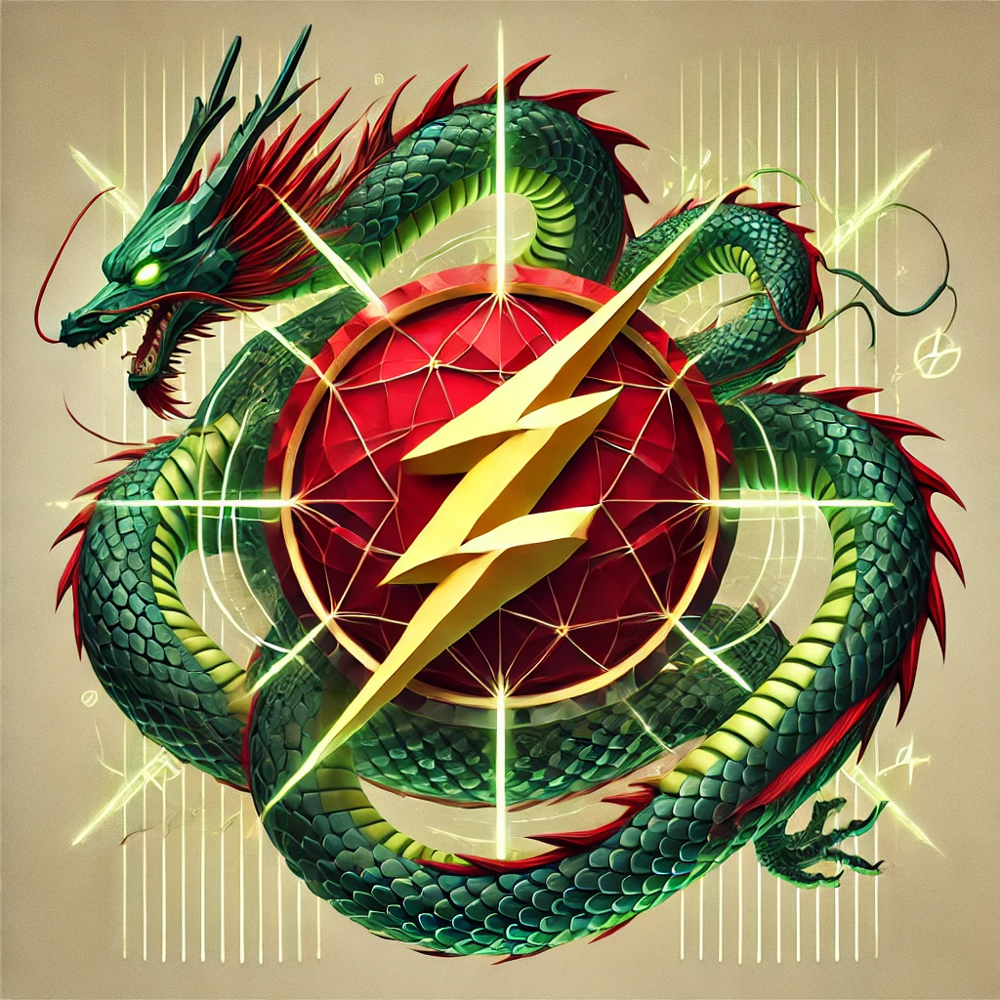

# Tensorized Spectral Filtering

<div align="center">
  
</div>

---

Research repository for the [Hazan Lab @ Princeton](https://sites.google.com/view/gbrainprinceton/projects/spectral-transformers?authuser=0) for experimenting with tensorized filtering.

The tensorized filtering algorithm was introduced in <b>Marsden et al. (2024)</b>: <em>Provable Length Generalization in Sequence Prediction via Spectral Filtering.</em> [arXiv:2411.01035](https://arxiv.org/abs/2411.01035).

## Preliminaries

Some briefing remarks about the repository.

### Data

We used the `o200k_base` tokenizer from [tiktoken](https://github.com/openai/tiktoken) to pre-tokenize roughly 10 billion tokens from [FineWeb-Edu](https://arxiv.org/abs/2406.17557) dataset for experimentation. Download it using this [link](https://drive.google.com/drive/folders/1G3axZCbS27ZuT4dBsnrcVPUDD-Fbd7BN?usp=sharing).

### Disclaimer

This is a research repository, not a polished library. Expect to see magic numbers. Expect to see hard-coded paths.

### Implementation

In the current implementation, we only generate the tensorized filters by taking the Kronecker product of the original filters proposed in <b>Agarwal et al. (2024)</b>: <em>Spectral State Space Models.</em> [https://arxiv.org/abs/2312.06837](https://arxiv.org/abs/2312.06837).

Notably, we omit the autoregressive components and projections from the original Tensorized Spectral Filtering algorithm (Algorithm 3) from Marsden et al. (2024).

## Setup
> Note: We recommend using the [uv](https://docs.astral.sh/uv/getting-started/installation/) package manager, made by Charlie Marsh '15.

### 1. Virtual environment (optional):

Create a virtual environment with one of the following options:

uv:
```zsh
uv venv --prompt tensorized-filters .venv
```
Python/pip:
```zsh
python3 -m venv --prompt tensorized-filters .venv
```
Conda:
```zsh
conda create -n tensorized-filters pytorch pytorch-cuda=12.4 -c pytorch -c nvidia
```

### 2. Installing packages:

> Note: If you want to use [Flash FFT](https://github.com/HazyResearch/flash-fft-conv) and/or [Flash Attention](https://github.com/Dao-AILab/flash-attention), you will need to have a CUDA-enabled device. Please see their repositories for further instructions on installation.

Install the required packages with:

uv:
```python3
uv sync
```

Python/pip:
```python3
pip install -e .
```

## Training

We included SLURM scripts for distributed training environments. For local testing, you can directly run the train.py scripts using `torchrun`.

## Contributions

We welcome contributors to:

- Submit pull requests
- Report issues
- Help improve the project overall

## License

Apache 2.0 License

You can freely use, modify, and distribute the software, **even in proprietary products**, as long as you:
- Include proper attribution
- Include a copy of the license
- Mention any changes made

It also provides an express grant of patent rights from contributors.

See the [LICENSE](LICENSE) file for more details.

## Citation
If you use this repository or find our work valuable, please consider citing it:

```
@article{tensorizedfiltering,
  title={Provable Length Generalization in Sequence Prediction via Spectral Filtering}, 
  author={Annie Marsden and Evan Dogariu and Naman Agarwal and Xinyi Chen and Daniel Suo and Elad Hazan},
  journal={arXiv preprint arXiv:2411.01035},
  year={2024},
  url={https://arxiv.org/abs/2411.01035}
}
```

```
@article{flashstu,
  title={Flash STU: Fast Spectral Transform Units},
  author={Y. Isabel Liu, Windsor Nguyen, Yagiz Devre, Evan Dogariu, Anirudha Majumdar, Elad Hazan},
  journal={arXiv preprint arXiv:2409.10489},
  year={2024},
  url={https://arxiv.org/abs/2409.10489}
}
```
